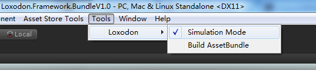
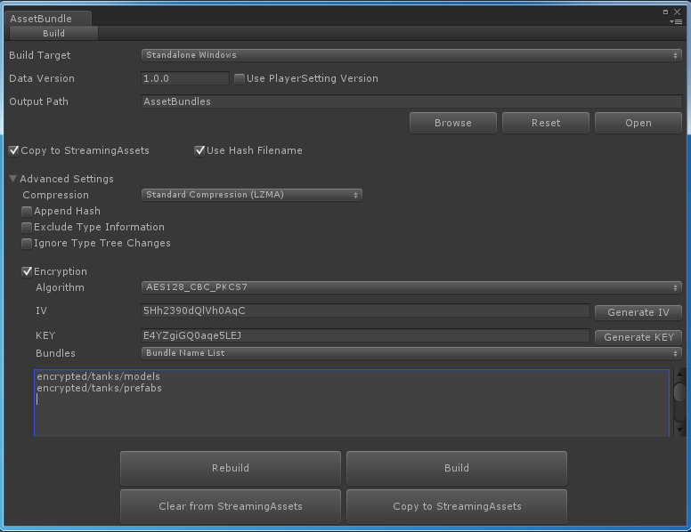
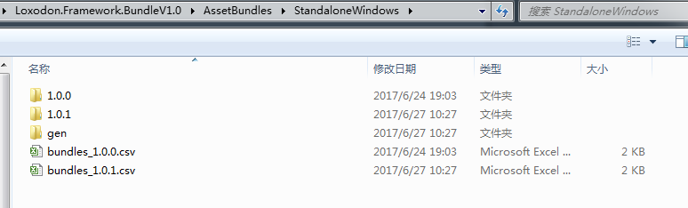
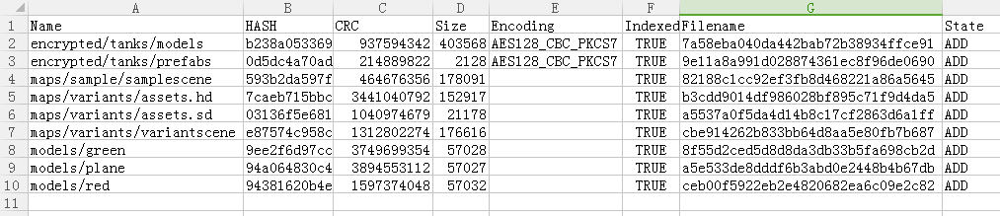

# Loxodon Framework Bundle

[](https://www.assetstore.unity3d.com/#!/content/87419)

**AssetBundle Manager for Unity3D**

*Developed by Clark*

Requires Unity 5.3.0 or higher.

Loxodon Framework Bundle is an AssetBundle manager.It provides a functionality that can automatically manage/load an AssetBundle,with its dependencies,from local or remote location.Asset Dependency Management including BundleManifest that keep track of every AssetBundle and all of their dependencies. An AssetBundle Simulation Mode, which allows for iterative testing of AssetBundles in a the Unity editor without ever building an AssetBundle.

**Tested in Unity 3D on the following platforms:**  
PC/Mac/Linux  
IOS  
Android

## Downloads  
- [Loxodon Framework Bundle](https://www.assetstore.unity3d.com/#!/content/87419)

## Key Features:
- Build AssetBundle.
- Encrypts/decrypts the file data of the AssetBundle.
- Support AssetBundle simulation mode.

## Quick start

```C#
    private IResources resources;

    void Awake()
    {
        /* Create a BundleManifestLoader. */
        IBundleManifestLoader manifestLoader = new BundleManifestLoader();

        /* Loads BundleManifest. */
        BundleManifest manifest = manifestLoader.Load(BundleUtil.GetReadOnlyDirectory() + BundleSetting.ManifestFilename);

        /* Create a PathInfoParser. */
        IPathInfoParser pathInfoParser = new AutoMappingPathInfoParser(manifest);

        /* Create a LoaderBuilder */
        ILoaderBuilder builder = new WWWComplexLoaderBuilder(new Uri(BundleUtil.GetReadOnlyDirectory()), false);

        /* Create a BundleManager */
        IBundleManager manager = new BundleManager(manifest, builder);

        /* Create a BundleResources */
        resources = new BundleResources(pathInfoParser, manager);
    }

    void Start()
    {
        string path = "LoxodonFramework/BundleExamples/Models/Green/Green.prefab";
        IProgressResult<float, GameObject> result = resources.LoadAssetAsync<GameObject>(path);
        result.Callbackable().OnProgressCallback(p =>
        {
            Debug.LogFormat("Progress:{0}%", p * 100);
        });
        result.Callbackable().OnCallback((r) =>
        {
            try
            {
                if (r.Exception != null)
                    throw r.Exception;
                GameObject.Instantiate(r.Result);
            }
            catch (Exception e) { Debug.LogErrorFormat("Load failure.Error:{0}", e); }
        });
    }
```
## Simulation mode in the editor
- In the editor,you can enable the simulation mode of the loading.Loads assets without having to build AssetBundle.



```C#
    void Awake()
    {
#if UNITY_EDITOR
        if (SimulationSetting.IsSimulationMode)
        {
            /* Create a PathInfoParser. */
            //IPathInfoParser pathInfoParser = new SimplePathInfoParser("@");
            IPathInfoParser pathInfoParser = new SimulationAutoMappingPathInfoParser();

            /* Create a BundleManager */
            IBundleManager manager = new SimulationBundleManager();

            /* Create a BundleResources */
            resources = new SimulationResources(pathInfoParser, manager);
        }
#endif
    }

    IEnumerator Start()
    {
        string path = "LoxodonFramework/BundleExamples/Models/Green/Green.prefab";
        IProgressResult<float, GameObject> result = resources.LoadAssetAsync<GameObject>(path);
        while (!result.IsDone)
        {
            Debug.LogFormat("Progress:{0}%", result.Progress * 100);
            yield return null;
        }

        if (result.Exception != null)
            yield break;

        GameObject.Instantiate(result.Result);
    }
```

## PathInfoParser

The PathInfoParser class is a path parser.

Note：Assets directory is the root of all assets,so it is omitted. 

	AssetBundle:characters.unity3d
	Asset:Assets/Characters/MonkeyKing.prefab
	
- SimplePathInfoParser example

```C#
	//BundleName:characters or characters.*  
	//AssetName:Assets/Characters/MonkeyKing.prefab
	string path = "characters@Characters/MonkeyKing.prefab";
        BundleManifest manifest = ...
        ILoaderBuilder builder = ...
        SimplePathInfoParser parser = new SimplePathInfoParser(new string[] { "@" });
        var resources = new BundleResources(parser, new BundleManager(manifest, builder));
        IProgressResult<float, GameObject> result = resources.LoadAssetAsync<GameObject>(path);
        result.Callbackable().OnCallback((r) =>
        {
            if (r.Exception != null)
                throw r.Exception;
            GameObject.Instantiate(r.Result);
        });
```
	
- AutoMappingPathInfoParser example

```C#   
	//AssetName:Assets/Characters/MonkeyKing.prefab
	string path = "Characters/MonkeyKing.prefab";
        BundleManifest manifest = ...
        ILoaderBuilder builder = ...
        AutoMappingPathInfoParserparser parser = new AutoMappingPathInfoParser(manifest);
        var resources = new BundleResources(parser, new BundleManager(manifest, builder));
        IProgressResult<float, GameObject> result = resources.LoadAssetAsync<GameObject>(path);
        result.Callbackable().OnCallback((r) =>
        {
            if (r.Exception != null)
                throw r.Exception;
            GameObject.Instantiate(r.Result);
        });
```

## Custom ILoaderBuilder

```C#
public class CustomBundleLoaderBuilder : AbstractLoaderBuilder
    {
        private bool useCache;
        private IDecryptor decryptor;

        public CustomBundleLoaderBuilder(Uri baseUri, bool useCache) : this(baseUri, useCache, null)
        {
        }

        public CustomBundleLoaderBuilder(Uri baseUri, bool useCache, IDecryptor decryptor) : base(baseUri)
        {
            this.useCache = useCache;
            this.decryptor = decryptor;
        }

        public override BundleLoader Create(BundleManager manager, BundleInfo bundleInfo, BundleLoader[] dependencies)
        {
            Uri loadBaseUri = this.BaseUri;
            
            if (this.useCache && BundleUtil.ExistsInCache(bundleInfo))
            {
                loadBaseUri = this.BaseUri;
                return new WWWBundleLoader(new Uri(loadBaseUri, bundleInfo.Filename), bundleInfo, dependencies, manager, this.useCache);
            }

            if (BundleUtil.ExistsInStorableDirectory(bundleInfo))
            {
                /* Path: Application.persistentDataPath + "/bundles/" + bundleInfo.Filename  */

                loadBaseUri = new Uri(BundleUtil.GetStorableDirectory());
            }
            else if (BundleUtil.ExistsInReadOnlyDirectory(bundleInfo))
            {
                /* Path: Application.streamingAssetsPath + "/bundles/" + bundleInfo.Filename */

                loadBaseUri = new Uri(BundleUtil.GetReadOnlyDirectory());
            }

            if (bundleInfo.IsEncrypted)
            {
                if (this.decryptor != null && bundleInfo.Encoding.Equals(decryptor.AlgorithmName))
                    return new CryptographBundleLoader(new Uri(loadBaseUri, bundleInfo.Filename), bundleInfo, dependencies, manager, decryptor);

                throw new NotSupportedException(string.Format("Not support the encryption algorithm '{0}'.", bundleInfo.Encoding));
            }

            return new WWWBundleLoader(new Uri(loadBaseUri, bundleInfo.Filename), bundleInfo, dependencies, manager, this.useCache);
        }
    }
```

## Custom BundleLoader

```C#
public class CustomBundleLoader : BundleLoader
{
    public CustomBundleLoader(Uri uri, BundleInfo bundleInfo, BundleLoader[] dependencies, BundleManager manager) : base(uri, bundleInfo, dependencies, manager)
    {
    }

    protected override IEnumerator DoLoadAssetBundle(IProgressPromise<float, AssetBundle> promise)
    {
        string path = this.GetAbsoluteUri();
        using (WWW www = new WWW(path))
        {
            while (!www.isDone)
            {
                promise.UpdateProgress(www.progress);
                yield return null;
            }

            if (!string.IsNullOrEmpty(www.error))
            {
                promise.SetException(new Exception(string.Format("Failed to load the AssetBundle '{0}' at the address '{1}'.Error:{2}", this.BundleInfo.Name, path, www.error)));
                yield break;
            }

            var assetBundle = www.assetBundle;
            if (assetBundle == null)
            {
                promise.SetException(new Exception(string.Format("Failed to load the AssetBundle '{0}' at the address '{1}'.", this.BundleInfo.Name, path)));
                yield break;
            }

            promise.UpdateProgress(1f);
            promise.SetResult(assetBundle);
        }
    }
}
```

## Build AssetBundle
Build AssetBundle,you can open a Editor window in menu: Tools/Loxodon/Build AssetBundle







## Contact Us
Email: [yangpc.china@gmail.com](mailto:yangpc.china@gmail.com) 


